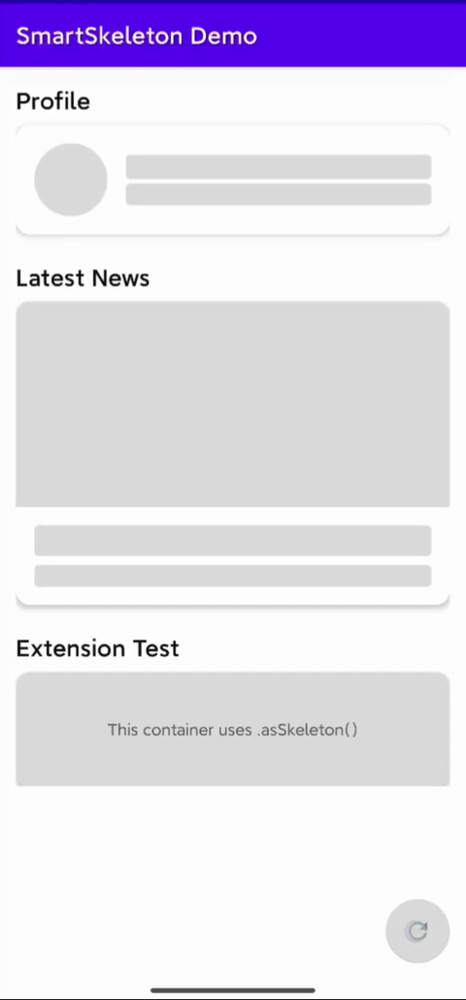

# SmartSkeleton

<div align="center">
  
</div>

A lightweight Android skeleton screen library with built-in shimmer animation. Views automatically show skeleton loading state and hide it when content is set.

## Features

- 🦴 **SkeletonTextView** — automatically shows skeleton when `text` is empty, hides when text is set
- 🖼️ **SkeletonImageView** — automatically shows skeleton when `drawable` is null, hides when image is set
- ✨ **Shimmer animation** — built-in smooth shimmer effect via `SkeletonDrawable`
- 🧩 **View extension** — `View.asSkeleton(show)` for any View
- 🎨 **XML customizable** — `skeletonRadius`, `skeletonBaseColor`, `skeletonHighlightColor`

## Setup

```groovy
dependencies {
    implementation 'cn.jingzhuan.lib:skeleton:1.0.1'
}
```

## Usage

### XML Layout

```xml
<cn.jingzhuan.lib.skeleton.widget.SkeletonTextView
    android:id="@+id/tv_title"
    android:layout_width="200dp"
    android:layout_height="20dp"
    app:skeletonRadius="8dp"
    app:skeletonBaseColor="#E0E0E0"
    app:skeletonHighlightColor="#EEEEEE" />

<cn.jingzhuan.lib.skeleton.widget.SkeletonImageView
    android:id="@+id/iv_avatar"
    android:layout_width="48dp"
    android:layout_height="48dp"
    app:skeletonRadius="24dp" />
```

### Kotlin

```kotlin
// SkeletonTextView: skeleton hides automatically when text is set
tvTitle.text = "Hello"

// SkeletonImageView: skeleton hides automatically when drawable is set
ivAvatar.setImageDrawable(drawable)

// Any View: use extension function
myView.asSkeleton(true)   // show
myView.asSkeleton(false)  // hide
```

### XML Attributes

| Attribute | Format | Default | Description |
|---|---|---|---|
| `skeletonRadius` | dimension | `4dp` | Corner radius |
| `skeletonBaseColor` | color | `#E0E0E0` | Base color |
| `skeletonHighlightColor` | color | `#EEEEEE` | Shimmer highlight color |

## License

Apache License 2.0
